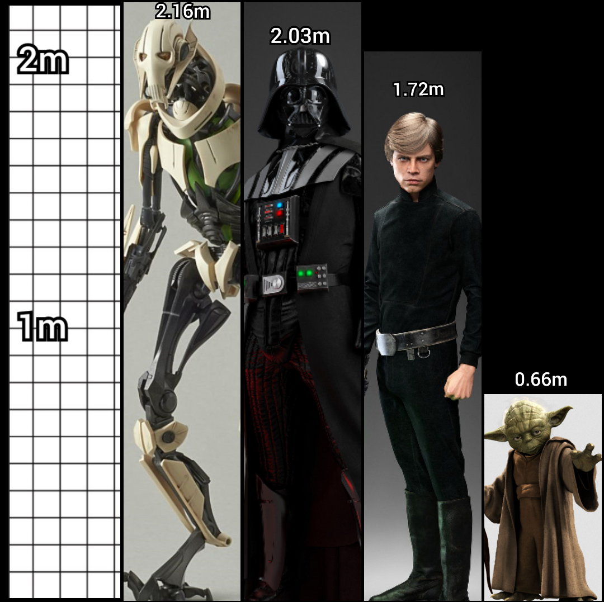

```{r setup, echo = FALSE, warning = FALSE, message = FALSE}
library(tidyverse)
library(kableExtra)
```

```{r first_chunk, echo = TRUE}
cat("Example of trivial r code in a chunk")
x <- 2 + 2
```

Example of in-line R code, which references that chunk: x = `r x`.  

```{r starwars-plot, fig.cap = "A ggplot of human Starwars character heights"}
g <- ggplot(starwars[which(starwars$species=="Human" & is.na(starwars$height)==FALSE),], aes(x = reorder(factor(name), -height), y = height))
g + geom_bar(stat = "identity") +
  theme_bw() +
  labs(title = "Heights of Star Wars Characters",
       x = "Character",
       y = "Height") +
  theme(axis.text.x = element_text(angle = 40, hjust = 1))
```

Some text referring to \@ref(fig:starwars-plot)

```{r starwars-tbl, fig.cap = "A table of human Starwars character heights"}
head(starwars[which(starwars$species=="Human"),],20) %>%
  select(name, height) %>%
  arrange(desc(height)) %>%
  knitr::kable(caption = "A knitr kable table of starwars data")
```
  
We can see, in table \@ref(tab:starwars-tbl) that people have heights.  

And finally, here is an image of some characters' relative heights:  


